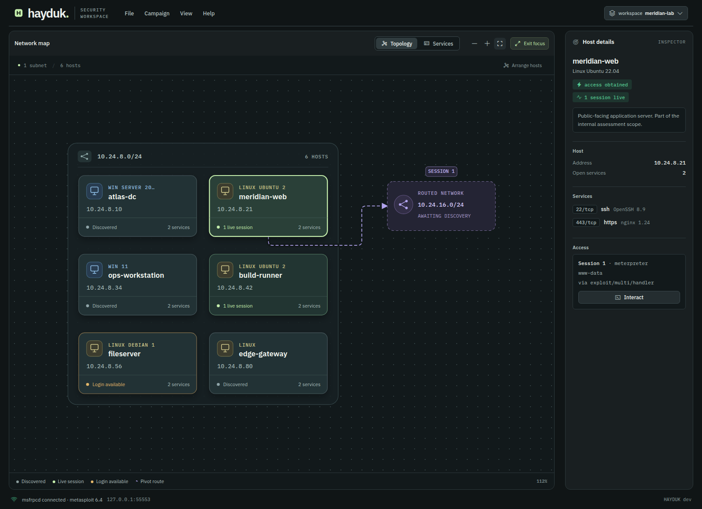

# Hayduk: Open-source Metasploit GUI and Armitage alternative

[](https://github.com/jolovicdev/hayduk/actions/workflows/ci.yml)
[](https://github.com/jolovicdev/hayduk/releases)
[](LICENSE)

Hayduk is a free, open-source **Metasploit GUI** for authorized penetration testing. It brings the Armitage workflow to your browser: map hosts, browse modules, manage Meterpreter and shell sessions, and export campaign reports.

**Download one binary. Run it. Connect to Metasploit.** No Java, Go, or Node.js installation is required to run a release binary. The browser UI is included.

Hayduk connects to a separate Metasploit Framework instance through `msfrpcd`. It does not bundle Metasploit.

**[Download the latest release](https://github.com/jolovicdev/hayduk/releases/latest)** · [Quickstart](#quickstart) · [Try the Docker lab](#try-the-docker-lab) · [Team mode](#team-mode)


*Interface shown with illustrative campaign data.*

## Quickstart

You need a Hayduk release binary, a browser, and a running Metasploit Framework instance. For workspace features such as hosts, services, credentials, and loot, Metasploit also needs a connected database.

The steps below assume Hayduk and Metasploit run on the same machine. If you need a ready-made Metasploit setup with a database and disposable targets, use the [Docker lab](#try-the-docker-lab).

### 1. Download and extract Hayduk

Open the [latest release](https://github.com/jolovicdev/hayduk/releases/latest) and choose the archive matching your operating system and processor. Extract the archive into a folder. There is no Hayduk installer or separate UI setup.

### 2. Start Metasploit RPC

On the machine running Metasploit, open a terminal and run:

```bash
msfrpcd -P 'yourpassword' -S -f -a 127.0.0.1 -p 55553
```

Replace `yourpassword` with your own password. Keep this terminal open. This command binds RPC to localhost on port `55553`; `-S` disables SSL for this local connection.

If you already run `msfrpcd`, use its existing connection settings instead of starting another instance.

### 3. Run Hayduk

Open another terminal in the extracted folder.

**Linux and macOS:**

```bash
./hayduk
```

**Windows PowerShell:**

```powershell
.\hayduk.exe
```

Hayduk opens the UI in your browser. If the browser does not open, copy the full URL printed in the terminal, including `?token=...`. The port is assigned automatically.

### 4. Connect

In **Connect to msfrpcd**, enter the settings from step 2:

| Field | Value |
|---|---|
| Host | `127.0.0.1` |
| Port | `55553` |
| User | `msf` |
| Password | The password you set above |
| use SSL | Unchecked |

Click **Connect**. A cold Metasploit instance can take about half a minute to respond; connection progress appears in the dialog.

Keep Hayduk running while you use the UI. Press `Ctrl+C` in its terminal to stop it.

## Your first campaign

Use a system or network you are authorized to test. Scans run from the connected Metasploit instance, so targets must be reachable from that machine.

Click a module to configure it. Right-click hosts, sessions, table rows, and modules in the tree to open their action menus.

Use the campaign summary cards to open hosts, services, sessions, or credentials. **Discover hosts**, **Scan services**, and **Export report** are also available directly above the network map.

The network map adapts host columns to the available canvas. Choose **Focus** to expand the map and host inspector. **Arrange hosts** replaces saved positions with an automatic layout. Host cards show open service counts and access state; violet paths identify pivot routes.

1. **Choose a workspace.** Click the **workspace** chip to switch between existing Metasploit workspaces, or use the current workspace. The active workspace scopes the database tables, topology, and exported report, keeping each client's campaign data separate. Events and sessions retain their originating workspace for report attribution; the **Sessions** tab shows sessions across workspaces.
2. **Discover hosts.** Open **Campaign → Discover hosts…**, enter your target host or CIDR range, select a scanner, and click **Configure…**. Review the module options and click **Launch**.
3. **Scan and inspect services.** Open **Campaign → Scan services…** and configure a scan for your target. Review the options before launching it. Open **View → Topology** to see discovered hosts, or **View → Services** to inspect service results.
4. **Launch an exploit and open a session.** Right-click an exploit module in the tree and choose **Launch…**, or open **Campaign → Find attacks…** and click a match's **Launch** button to prefill the target host and matched port. Review the module options and payload, then click **Launch**. If a session opens, click its row in the **Sessions** tab, or right-click its host and choose **Interact with session <ID>**, to open the live console in **Interact**.
5. **Export a report.** Choose **File → Export report…** to download a self-contained HTML campaign report.


*Demo uses illustrative campaign data.*

## Features

| Capability | What you can do |
|---|---|
| Network topology | Explore adaptive subnet groups, host service counts, and pivot routes. Drag hosts, zoom, or expand the map in Focus mode. |
| Metasploit modules | Browse the module tree, inspect reliability ranks, configure options, and select payloads. |
| Campaign workflows | Discover hosts, scan services, and find exploit candidates matching known services. |
| Session management | Interact with Meterpreter and shell sessions, upgrade shells, and terminate sessions. |
| Credentials and loot | Review workspace data and use recovered credentials in login workflows. |
| Hail Mary | Launch matching exploits against selected hosts, with paced launches and an event log. |
| Reporting | Export a self-contained HTML report for campaign review and client delivery. |
| Team mode | Share a campaign with multiple operators on a trusted network. |



*Graph focus mode with illustrative campaign data.*

## Try the Docker lab

The repository includes a disposable Metasploit lab with a database and optional target containers. Run it to try the workflow from the demo against live targets.

You need Git, Docker, and Docker Compose. Run these commands from a shell that supports the repository's `.sh` scripts:

```bash
git clone https://github.com/jolovicdev/hayduk.git
cd hayduk
scripts/msf/up.sh --with-vulnbox
```

The script prints the target container IP addresses when the lab is ready. Start your downloaded Hayduk binary and connect with **Host** `127.0.0.1`, **Port** `55553`, **User** `msf`, **Password** `testpass123`, and **use SSL** unchecked. Use a printed target IP for your first scan.

To start only Metasploit and its database, run `scripts/msf/up.sh` without `--with-vulnbox`.

When finished, run this from the repository root. It removes the lab containers and their volumes, including lab database data:

```bash
scripts/msf/down.sh
```

## Team mode

Run the downloaded binary with a specific interface address that your operators can reach:

```bash
./hayduk --team --listen 192.168.1.10:8787
```

Replace `192.168.1.10` with your machine's address. Team mode requires an explicit, non-loopback address; wildcard addresses such as `0.0.0.0` are refused.

Share the full token URL printed in the terminal. Each operator opens it in a browser and chooses a name. The event log attributes actions to those names.

Team mode uses one shared token and plain HTTP. Operator names are labels, not verified identities. Treat the token URL like a password and use team mode only on trusted networks. Read the [security policy](SECURITY.md) for the full trust model.

## Troubleshooting

| Problem | What to check |
|---|---|
| The browser does not open | Open the full token URL printed by Hayduk. You can also start with `./hayduk --no-browser`. |
| Hayduk cannot connect | Check that `msfrpcd` is running and that the host, port, user, and password match. |
| SSL connection fails | Leave **use SSL** unchecked when `msfrpcd` runs with `-S`; enable it when the daemon uses SSL. |
| Connection takes time | Watch the connection dialog. A cold Metasploit instance can take about half a minute to respond. |
| Hosts or services are missing | Check the selected workspace, Metasploit's database connection, and target reachability from Metasploit. |

## FAQ

### Is Hayduk an Armitage alternative?

Yes. Hayduk follows Armitage's graphical Metasploit workflow, including network topology, module launching, Hail Mary, and shared campaigns. It is a separate implementation with a browser UI and a single Go binary.

### Does Hayduk include Metasploit Framework?

No. Hayduk is a GUI client for Metasploit's `msfrpcd` service. Use your existing Metasploit installation or the included Docker lab.

### Do I need Go, Node.js, Java, or Docker?

No additional language runtime is required for the Hayduk release binary. Go and Node.js are needed to build from source. Docker is needed only if you choose the included lab.

### Can Hayduk connect to Metasploit on another machine?

Yes. Enter the Metasploit machine's reachable address in **Host** and match its RPC port, credentials, and SSL setting. The localhost-only RPC command in Quickstart accepts connections only from the same machine.

### Is Hayduk free and open source?

Yes. Hayduk is released under the [MIT license](LICENSE).

## Build from source

For development, use Go 1.26.1 or newer, Node.js 24 as used in CI, npm, and Make. From the repository root:

```bash
make
./bin/hayduk
```

`make` installs UI dependencies, builds and embeds the UI, and compiles `bin/hayduk`.

### Development

After the initial build, run the UI server in one terminal:

```bash
cd ui
npm run dev
```

In a second terminal at the repository root:

```bash
make dev
```

Open the URL printed by Hayduk. UI changes reload through the development proxy.

### Checks

Run these commands from the repository root:

```bash
make test          # Go and UI tests
npm --prefix ui run lint
make               # Type-check, build the UI, and compile the binary
make integration   # Requires the running Docker lab
```

Protocol types are generated. With `tygo` available, run `make gen` after editing `internal/protocol/protocol.go`; `make gen-check` checks for generated type drift.

## Credits and license

Hayduk draws on the graphical attack management workflow established by [Armitage](https://github.com/rsmudge/armitage), created by Raphael Mudge. It connects to Metasploit through [go-msf](https://github.com/jolovicdev/go-msf).

Licensed under [MIT](LICENSE). See [third-party notices](docs/THIRD-PARTY-NOTICES.md) for bundled assets and licenses.
