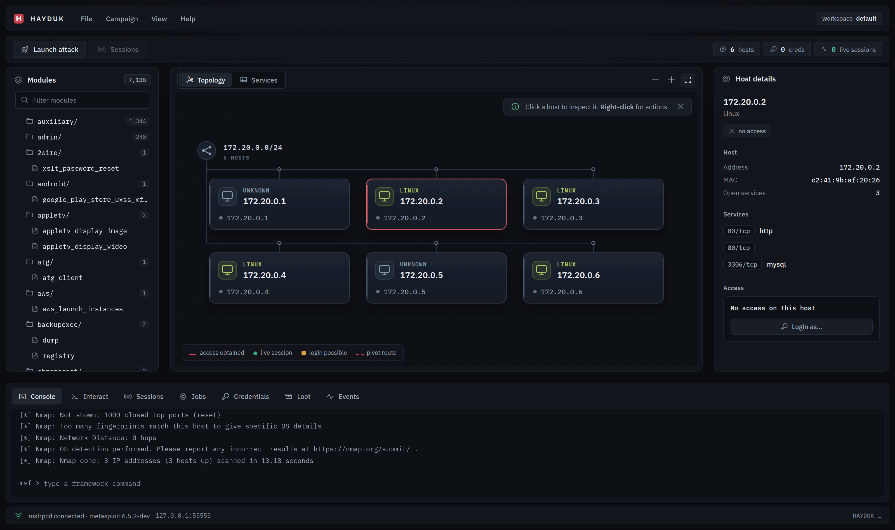

# Hayduk

Hayduk is a graphical attack management console for Metasploit: the lineage of Armitage,
rebuilt as a single Go binary with a browser UI. It drives msfrpcd through
[go-msf](https://github.com/jolovicdev/go-msf).

**For authorized security testing only.**

## What you get

- **Live network topology**: hosts grouped by subnet, access states, pivot
  routes drawn as dashed edges, node positions that survive reloads
- **Campaign workflows**: host discovery and service scans, login attacks
  with pre-filled recovered credentials, and Find attacks matching exploits
  to a host's services
- **Hail Mary**: the Armitage signature move; fire every matching exploit
  at the chosen hosts in one click, paced, every launch in the event log
- **Sessions**: interact with meterpreter and shells, upgrade shells to
  meterpreter, kill; console and session output stream live with the real
  prompt and busy state
- **Module launcher**: the full module tree with reliability ranks, option
  editing, payload selection
- **Credentials, loot and events**: everything the workspace database
  knows, plus an attributed event log
- **Report export**: one self-contained HTML document summarizing the
  campaign, safe to hand to a client
- **Team mode**: several operators on one shared campaign (trusted
  networks)

## Quickstart

Build (needs Go 1.26+ and Node):

    make            # builds the UI, embeds it, compiles bin/hayduk
    ./bin/hayduk

The console opens in your browser. Point it at a running msfrpcd:

    msfrpcd -P yourpassword -S -f -a 127.0.0.1

or spin the disposable docker lab used by the integration tests:

    scripts/msf/up.sh                  # msfrpcd on 127.0.0.1:55553, user msf / testpass123
    scripts/msf/up.sh --with-vulnbox   # plus disposable target boxes to scan and attack
    scripts/msf/down.sh

The screenshot above is Hayduk live against that lab: six discovered hosts,
real OS fingerprints and services.

## Team mode

    ./bin/hayduk --team --listen 0.0.0.0:8787

Team mode requires an explicit non-loopback bind. Every operator opens the
printed token link, picks a name, and that name rides on their commands and
lands next to their actions in the shared event log. Authentication is the
one-time token URL; treat the link like a password and only run team mode
on networks you trust.

## Testing

    make test         # go test ./... + ui tests
    make integration  # against the docker stack above

## Development

Terminal 1: cd ui && npm run dev
Terminal 2: make dev
Open the URL that Hayduk prints. The UI hot-reloads through the dev proxy.

Protocol types are generated: `make gen` after touching
`internal/protocol/protocol.go`; `make gen-check` catches drift.

## Credits

Design lineage: Armitage by Raphael Mudge.

License: MIT
